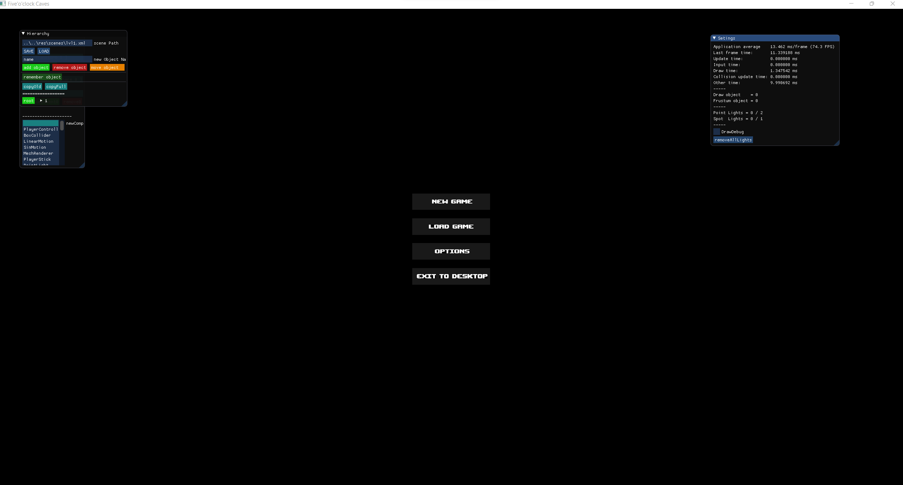
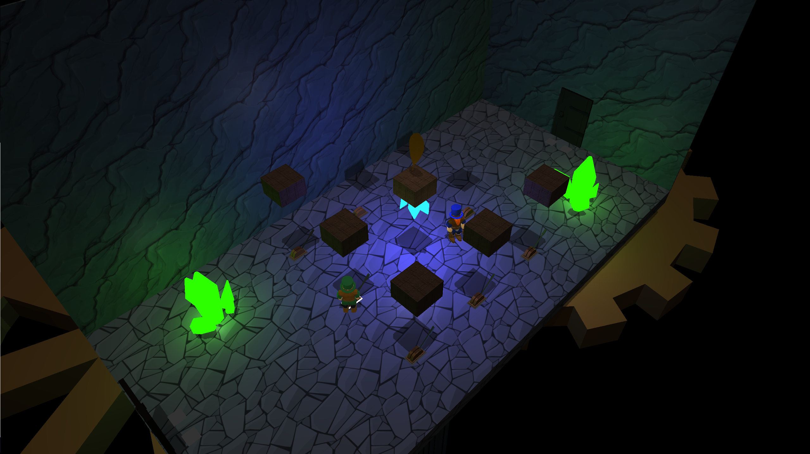

# Five'o'clock Caves

Najszybszym sposobem na zbudowanie gry jest pobranie projektu opartego na CMake, który sam ściągnie odpowiednie biblioteki, dołączy je do projektu i odpowiednio skonfiguruje środowisko programistyczne. 
__UWAGA:__ Należy pamiętać również o sciągnięciu submodułów (_git submodules_)!!

Następnie za pomocą linii komend, wchodzimy do folderu gdzie pobraliśmy repozytorium i wywołujemy następujące polecenia:
```
mkdir Build
cd Build
cmake .. -G "Visual Studio 16/17"
```

Te polecenia stworzą w folderze Build solucję Visual Studio 2019/2022 (zakładając, że działamy na komputerze wyposażonym w system Windows i IDE Visual Studio 2019).

By uruchomić projekt za pomocą VS 2019, wchodzimy do folderu _Build_, otwieramy solucję _FiveOClock_Caves.sln_. Następnie, klikamy prawym przyciskiem myszy na projekcie _FiveOClock_Caves_ i wybieramy opcję _Ustaw jako projekt domyślny / Set as a startup project_. Następnie budujemy i uruchamiamy aplikację.

Jeżeli korzystamy z IDE Clion (jest darmowa licencja dla studentów) lub Visual Studio 2019/2022 Community, wystarczy wybrać w nim opcję otwarcia projektu, i z folderu repozytorium wybrać plik _CMakeLists.txt_. Następnie Clion / Visual Studio 2019/2022 sam uruchomi skrypt CMake i pobierze odpowiednie biblioteki. Możemy teraz zbudować i uruchomić projekt.

W obu przypadkach powinno pojawić się okienko startowe gry. 

__Dokumentacja__ ImGUI znajduje się w pliku _thirdparty/imgui/imgui.cpp_.

__UWAGA:__ Należy pamiętać, że po zbudowaniu projektu nie próbować ładować żadnych zapisów! Należy w tym celu pobrać gotowy zip z grą.

Widok poprawnie zbudowanej i uruchomionej gry:


(ss2.png)
